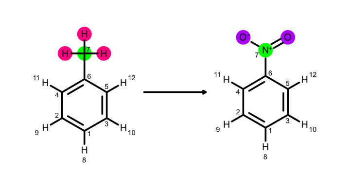

# Things we won't do

* Load a structure with missing atoms
* Check for clashes or structural errors
* Support automatic filling in missing atoms/loops 

# User contracts

* Input data should have all the hydrogens. Complete molecules.
* Molecules can only become invalid through inplace modifications. Methods would not return invalid molecules.

# Guided example(s)


```python
# Load structures and perceive info
# This PDB file must have explicity hydrogens
protein = Molecule.from_pdb_file('protein.pdb')

# Pick some peptide C=O bond. The bond orders have been filled in for a library of substructures.
protein.atoms[9]
> <Atom with name O with element O>

protein.bonds[10]
> <Bond with bond_order 2 and atom1_index 9 and atom2_index 10>

print(protein.residues)
> ALA ALA LYS ALA

dna = Molecule.from_file('dna.sdf')
dna.bonds[10]
> <Bond with bond_order 1 and atom1_index 7 and atom2_index 11>

# Note that the SDF format doesn't contain residue names or numbers
dna.residues
> AttributeError
print(dna.atoms[30].metadata)
> {}
# This method searches a dictionary of substructures to assign common residue names and numbers
dna.perceive_residues(nucleotides=True)
dna.residues
> A T C G
print(dna.atoms[30].metadata)
> {'residue_num':2, 'residue_name':'T', 'chain':'A'}

# Where they attach
protein_attachment = protein.mdtraj_sel('resname LYS and name CD')
dna_attachment = dna.chemical_environment_matches('c1ccn([H:1])c1')
# What gets removed
protein_to_remove = protein.mdtraj_sel('resname LYS and name HD2')
dna_to_remove = dna.chemical_environment_matches('c1ccn([H:1])c1')

# Merge the two
new_molecule = Molecule.merge_molecules(protein, dna,
                                        protein_attachment,
                                        dna_attachment,
                                        protein_to_remove,
                                        dna_to_remove,
                                        bond_order=1, keep_metadata=False)

# Clear out old hierarchy definition and re-assign residue numbers and names
new_molecule.perceive_residues(amino_acids=True, 
                               nucleotides=True, 
                               clear_existing=True,
                               scheme='default')
new_molecule.residues
> ALA ALA UNK ALA T C G
```

 What if we wanted to keep the old residue names (and avoid residue `UNK`?)


```python
# Merge the two
new_molecule = Molecule.merge_molecules(protein, dna,
                                        protein_attachment,
                                        dna_attachment,
                                        protein_to_remove,
                                        dna_to_remove,
                                        bond_order=1, keep_metadata=True)


# The residue numbers will now collide because we specified keep_metadata=True
new_molecule.residues
> ALA ALA LYS ALA A C T G

new_molecule.residue(5)  # Selects atoms in 6th residue in iter, but this thinks it's residue number 3
> <HierarchyElement with type residues with residue_num 3 residue_name C with chain A>


# Increment the residue numbers before the merge to keep them distinct
n_protein_res = len(protein.residues)
for residue in dna.residues:
    residue.residue_num += n_protein_res + 1
    
new_molecule = Molecule.merge_molecules(protein, dna, protein_attachment, dna_attachment, 
                                        bond_order=1, keep_metadata=True)   
    
# If there are two iterators with the same name we extend them
new_molecule.residues
> ALA ALA LYS ALA A T C G

new_molecule.residue(5)  
> <HierarchyElement with type residues with residue_num 7 residue_name C with chain A>
```

Why do I keep seeing the word "Hierarchy"?


```python
print(protein.hierarchy_schemes)
> [<HierarchyScheme with method_name='residues' uniqueness_criteria=['chain', 'residue_num', 'residue_name']>,
   <HierarchyScheme with method_name='chains' uniqueness_criteria=['chain']>]

protein.add_hierarchy_scheme(...)


```

How do we keep track of changes?


```python
len(protein.atoms)
> 80
len(dna.atoms)
> 100
protein_attachment.hier_info['residue']
> <HierarchyElement with type residues with residue_num 3 residue_name LYS with chain A>
protein_attachment.index
> 42
dna_attachment.hier_info['residue']
> <HierarchyElement with type residues with residue_num 1 residue_name C with chain A>
dna_attachment.index
> 11

new_molecule = Molecule.merge_molecules(protein, dna,
                                        protein_attachment,
                                        dna_attachment,
                                        protein_to_remove,
                                        dna_to_remove,
                                        bond_order=1, keep_metadata=True,
                                        return_atom_maps=True
                                       ) 

len(new_molecule.atoms)
> 178
mol1_to_new_mol_idxs
> {0: 0, 1: 1, ..., 42: 42, 43: 43, ..., 78: 78}  # One atom was removed
mol2_to_new_mol_idx2
> {0: 79, 1: 80, ..., 98: 177}

new_molecule.residues
> ALA ALA LYS ALA A T C G

```

Hybrid topology

 


```python
new_molecule, hybrid_molecule = Molecule.merge_molecules(mol1=toluene, 
                                                         mol2=nitro_group_w_h, 
                                                         mol1_attachment_points=[6], # from diagram above 
                                                         mol2_attachment_points=[1], #the N in the nitro group
                                                         mol1_atoms_to_delete=[7,13,14,15], #the methyl
                                                         mol2_atoms_to_delete=[4] # a hydrogen
                                                         bond_order=1, 
                                                         return_hybrid_molecule=True)
type(hybrid_molecule)
> AtomTypedMolecule

hybrid_molecule.n_atoms
> 29 
hybrid_molecule.n_atoms == toluene.n_atoms + nitro_group_w_h.n_atoms
> True

# The methyl carbon and Hs don't map to anything in the new mol
print([(atom.molecule_atom_index,
        atom.metadata['mol1_index'], 
        atom.metadata['mol2_index'],
        atom.metadata['new_molecule_index'])
        for atom in hybrid_molecule.atoms])
> [
    (0,0,None,0), (1,1,None,1), ..., (6,6,None,6),               # in mol1 and new mol (& not mol2)
    (7,7,None,None),                                             # Core atom (shared between both)
    (8,8,None,8), ..., (12,12,None,12),                          # Hydrogens in the core/phenyl
    (13, 13, None, None), (14, 14, None, None),                  # Only in mol1
    (15, None, 0, 7), (16, None, 1, 13), (17, None, 2, 14),      # in mol2 and new mol (& not mol1)
    (18, None, 3, None)                                          # Only in mol2
]

    

```


```python
#Molecule.from_smiles('[O-][N+](=O)[H]')
```

Having residues as molecules with and without capping.

* Redirect this to RD/OE substructures


```python
# Without caps
oe_substructure = OpenEyeToolkitWrapper.hier_element_to_substructure(protein.residues[10])
oe_substructure
> <oechem.OEMol or AtomBondSet something>

rdk_substructure = RDKitToolkitWrapper.hier_element_to_substructure(protein.residues[10])
> <rdkit.Chem.Mol or Qmol or something>

# ^^^Need feedback on return types for each toolkit^^^

# With caps
protein.residues[10].hierarchy_scheme.
Molecule.from_amino_acid(protein.residues[10])
protein.residues[10].to_capped_amino_acid(mol_class=Molecule)

protein.residues[10]
> <HierarchyElement with some settings>?
OR
> <ResidueHierarchyElement ...>?

class SomeClass:
    def __init__(self, handler):
        self.handler = handler
        
instance = SomeClass(another_object)


# Plugin interface? We need to learn more for this case
capped_residue = Molecule.from_hier_element(protein.residues[10], capping_scheme='methyl')
capped_residue
> <openff.toolkit.topology.Molecule with SMILES CN[C@](C)C(=O)C >

capped_residue = Molecule.from_hier_element(protein.residues[10], capping_scheme='n_charge')
capped_residue
> <openff.toolkit.topology.Molecule with SMILES [N+][C@](C)C(=O)C >

#Where does CCD have these reactions?
capped_residue = Molecule.from_hier_element(protein.residues[10], capping_scheme='from_ccd') 
capped_residue
> <openff.toolkit.topology.Molecule with SMILES [N+][C@](C)C(=O)[O-] >


protein.hierarchy_schemes['residues'].capping_reactions 
#Should it live in a ToolkitWrapper? Or HierarchyScheme/Element?
> {'methyl': ('C(=O)C[N-:1]>[N:1]C',
              '[C-:1]>[C:1]C'),
   'n_charge': ('[N-:1]>[N+:1][H][H]')
  }

protein.residues[10].hierarchy_scheme
> <HierarchyScheme with name 'residues' with uniqueness_criteria ('chain', 'residue_num', 'residue_name')> 


# OR, if we don't want to store capping reactions:

capped_residue = Molecule.from_hier_element(protein.residues[10], capping_reactions=['[N-:1]>[N+:1][H][H]']) 
capped_residue
> <openff.toolkit.topology.Molecule with SMILES [N+][C@](C)C(=O)[O-] >

```

# Reading from file

Reading biopolymer molecules from files, either in `sdf` or in `pdb` formats.

* from `sdf`: No residue information.
* from `pdb`: No detailed chemical information. Bond order, formal charges, stereochemistry, etc.

**Multiple molecules in single file**, so far. Molecule expected to be complete, including hydrogens.

* Load from SDF, perceive residues
* Load from PDB, fill in details according to known residues?


```python
protein = Molecule.from_file('some_mol.sdf')
protein.perceive_residues(pattern=['SMARTS_PATTERN', 'SMARTS_PATTERN2'])

dna_helix = Molecule.from_file('some_dna.sdf')
dna_helix.perceive_residues(nucleotides=True)
# Do we want to differentiate deoxy with ribonucleotides?

protein = Molecule.from_pdb_file('some_mol.pdb')

print(protein)
> Molecule with 5000 atoms

protein = Molecule.from_pdb_file('some_mol_missing_hs.pdb')
> IncompletePDBError: The Open Force Field Toolkit requires all 
> protons to be assigned before reading from PDB format. 
> (possibly more info here)

# Perceiving residues - Should be automatic for PDB
protein.perceive_residues()

```

Or we could have a special atom-typed object


```python
# Or a special atom-typed molecule
protein = PDBMolecule.from_pdb_file('some_mol.pdb')
print(protein)
> <PDBMolecule ...>
```

Or we could have a special method for atom-typed molecules/files


```python
# Or special method for PDB (atom-typed)
protein = Molecule.from_pdbfile('some_mol.pdb')
print(protein)
> <Molecule with X atoms>
```

# Reading from sequence

Reading biopolymer molecules from monomer/aa sequence string.

> - What about terminal caps? 

**Not much of a use for this**

    How to come up with conformers? Protonation? 
    How to match conformers to sequence?


```python
# from 3-letter code
protein = Molecule.from_sequence("AlaValGly", code='3-letter')

# from 1-letter code (default?)
protein = Molecule.from_sequence("AVQ")

print(protein)
> Molecule with 5000 atoms

# from 1-letter code (default?)
protein = Molecule.from_sequence("AVQZ")
> UnrecognizedAAError: Unrecognized amino acid in position 3.
# Analogous for 3-letter code. Could simply a ValueError do it?
```

# Histidines Protonation states

If we know the bonds orders we should be able to know the protonation state at a given pH and vice versa.


```python

```

# Flexible bookkeeping and grouping

Some (many?) of these things can be accomplished using some selection algebra language, as many visualizers and packages do (e.g. `name CA and resn LYS` ). We could eventually have a `to_mdtraj` as a way to use its selection language capabilities.


## Atoms


```python
protein = Molecule.from_file('protein.sdf')
protein.atoms
> <generator object at ... >

```


## Residues

Residues in molecule should be iterable.

**NOTE:** Do we need a `Residue` type? Would the `Molecule` type be sufficient? 


```python
# From SDF
protein = Molecule.from_file('protein.sdf')
protein.atoms[10].metadata['residue_name']
> KeyError: Whats a residue?
protein.perceive_residues()
protein.atoms[10].metadata['residue_name']
> ALA
protein.atoms[10].metadata['residue_num']
> 2

# From PDB
protein_from_pdb = Molecule.from_pdb_file('protein.pdb')
protein_from_pdb.atoms[10].metadata['residue_name']
> ALA


```


```python
protein.perceive_hierarchy(['residues', 'chains'])
type(protein.residues[10])
> <HierarchyElement of type residues with id ('A', 10, 'ALA') ...>
dir(protein.residues[10])
> [atoms, chain, residue_num, residue_name]
protein.residues[10].atoms
[150, 151, 152... 171]
protein.atoms[150].hier_info['residues']
> <HierarchyElement of type residues with id ('A', 10, 'ALA') ...>
protein.atoms[150].hier_info['chains']
> <HierarchyElement of type chain with id ('A',) ...>

# The user is allowed to shoot themself in the foot, and use the public API to fix it
protein.residues[10].atoms.append(900)
protein.residues[10].atoms
[150, 151, 152... 171, 900]
protein.atoms[900].hier_info['residues'] = protein.residues[10]

# manually modifying a residue can also get the backreferences broken
protein.residues[10].atoms = protein.residues[10].atoms[1:]
protein.atoms[150].hier_info['residues']
> <HierarchyElement of type residues with id ('A', 10, 'ALA') ...>
# fix
del protein.atoms[150].hier_info['residues']

# What if there's some special hand-modifications already performed, but the user has added something 
# new and wants that to have only the new parts to have their hierarchy percieved?
protein.perceive_hierarchy()
```

* Support iteration over `Biopolymer.residues` when residues are separated by
    * resname/residue + resnum/resid


```python
protein.residues
> <generator object residues at 0x7f7268acecf0>

residues_list = []
for residue in protein.residues:
    residues_list.append(residue)

print(residues_list)
> [<Residue ABC, ID1>, ..., <Residue XYZ, IDN>]
```


```python
print(protein.hierarchy_schemes)
> [<HierarchyScheme with method_name='residues' uniqueness_criteria=['chain', 'residue_num', 'residue_name']>,
   <HierarchyScheme with method_name='chains' uniqueness_criteria=['chain']>]

protein.add_hierarchy_scheme(...)


```

We should expose only the setters defined by the hierarchy scheme


```python
# Using the hierarchy scheme above
protein.perceive_hierarchy(scheme=['residues'])
protein.residues[10]
> <HierarchyElement of type "residues" with id ('A','11','ALA') with residue_num 11, chain A, residue_name ALA>
protein.residues[('A','11','ALA')]
> <HierarchyElement of type "residues" with id ('A','11','ALA') with residue_num 11, chain A, residue_name ALA>


protein.residues[10].residue_name
> ALA
protein.residues[10].residue_num
> 2
protein.residues[10].chain
> 0
or 
> "A"
protein.residues[10].residue_name = "LYS"
protein.residues[10].residue_name
> LYS
protein.residues[10].residue_num = 5
protein.residues[10].residue_num
> 5


# Now Change the hierarchy scheme -- What does it do with the previous hierarchy metadata?
protein.perceive_hierarchy(scheme=['chains'])
[*protein.chains]
> SomeSortOfDictyList[<HierarchyElement of type "chains" with id "A" with chain A>]
protein.chains[0]
> <HierarchyElement of type "chains" with id "A" with chain A>
protein.chains['A']
> <HierarchyElement of type "chains" with id "A" with chain A>

protein.residues[10].chain = 'B'
protein.residues[10].chain
> "B"

# Option 1 -- Let's do this one!
protein.chains['B']
> KeyError
protein.perceive_hierarchy(scheme=['chains'])
protein.chains['B']
> <HierarchyElement of type "chains" with id "B" with chain B>

# Option 2 -- This is probably bad, because it means the hierarchies are silently being re-percieved in the
# background, which could screw with things that the user manually set
protein.chains['B']
> <HierarchyElement of type "chains" with id "B" with chain B>


protein.chains['A'].chain = 'B'
[*protein.chains]
> SomeSortOfDictyList[<HierarchyElement of type "chains" with id "B" with chain B>]


```


```python
protein.residues[10]
> <HierarchyElement of type "residues" with id ('A','11','ALA') with residue_num 11, chain A, residue_name ALA>

protein.residues[('A','11','ALA')]
> <HierarchyElement of type "residues" with id ('A','11','ALA') with residue_num 11, chain A, residue_name ALA>

protein.residues[10].chain
> A
protein.residues[10].chain='Z'
protein.residues[10].chain
> A
protein.residues[-1].chain
> Z

protein.residues[('A','11','ALA')]
> KeyError

protein.residues[10]
> <HierarchyElement of type "residues" with id ('A','12','HIS') with residue_num 12, chain A, residue_name HIS>

protein.residues[('Z','11','ALA')]
> <HierarchyElement of type "residues" with id ('Z','11','ALA') with residue_num 11, chain Z, residue_name ALA>
protein.residues[-1]
> <HierarchyElement of type "residues" with id ('Z','11','ALA') with residue_num 11, chain Z, residue_name ALA>

```

Drawbacks of the above approach
* It is dangerous to allow integer-based access to hierarchy-lists, since they can go out of date
    * Maybe only expose iterator?
    * Should we expose subscriptable access at all? (allow `protein.chains[('A',)]`?). Or only allow acces via things like `protein.select_residues`?
* It is dangerous to allow atom-level metadata assignment though HierarchyElements, since they can change the groupings
* 

Possible future ideas?
* Allow hierarchies within hierarchies? `protein.chains['A'].residues`?

### Nonstandard residue handling

* Detect unnatural AA and assign parameters, gracefully handle backbone interface w/ natural AAs
* Modified AA becomes a single residue
* Modified AA becomes several residues (maybe one for each monosaccharide)

What if the lipid is attached in more than one site? 


```python
protein = Molecule.from_file('protein.sdf')
lipid = Molecule.from_file('lipid.sdf')

print(protein.atoms[10].metadata['resname'])
> KeyError: 

protein.perceive_residues(skip_hierarchy=True)
print(protein.atoms[10].metadata['resname'])
> ALA

protein.residues
> AttributeError

protein.perceive_hierarchy()  # Exposes iterables
protein.residues
> ALA ALA LYS GLU

protein_attachment_h = protein.mdtraj_sel('resname LYS and name HD2')[0]
lipid_attachment_h = lipid.mdtraj.sel('name H1')[0]
# This would end up with "invalid" mols -- get rid of it
# protein.delete_atom(protein_attachment_h)
# lipid.delete_atom(lipid_attachment_h)
#add a new bond between the atoms that had their Hs removed
#protein.add_bond(protein_attachment_h-1, lipid_attachment_h-1) 

new_molecule = Molecule.merge_molecules(protein, lipid, protein_attachment_h, lipid_attachment_h, 
                                        bond_order=1, keep_metadata=False)

# Scheme is how to handle unknown regions of the molecule
# e.g. The modified region becomes a single unknown residue
new_molecule.perceive_hierarchy(scheme='default')


print([*new_molecule.residues])
> ALA, ALA, UNK, GLU

new_molecule.clear_hierarchy()
# Different scheme. The modified region tries to retain the original res label
new_molecule.perceive_hierarchy(scheme='separate_ptms')
print([*new_molecule.residues])
> ALA, ALA, LYS, LIP, GLU


# change atom properties/data
protein.atoms[10].metadata['resname'] = 'GLU'
protein.atoms[10].update_metadata(key='resname', value='GLU')
```

Merge_molecules should optionally return a mapping from the original atom indices to the new ones


```python
len(protein.atoms)
> 10000
len(dna.atoms)
> 5000
protein_attachment
> <Atom with name H with element H>
dna_attachment
new_molecule, mol1_to_new_mol_idxs, mol2_to_new_mol_idx2 = Molecule.merge_molecules(protein, 
                                                                                    lipid, 
                                                                                    protein_attachment_h, 
                                                                                    lipid_attachment_h, 
                                                                                    bond_order=1, 
                                                                                    keep_metadata=False, 
                                                                                    return_atom_maps=True)
mol1_to_new_mol_idxs
> {0: 0, 1:1, ..., 9999:9999}
mol2_to_new_mol_idx2
> {0:, 1:, ..., 4999:}
```

Get residues given IDs


```python
protein.select_residues(resid=23)
> [<Residue GLY, 23>]

# Do we want to be able to get groups of residues? (what about getting atoms from these?)
protein.select_residues(resid=[23, 72, 12])
> [<Residue GLY, 23>, <Residue GLY, 23>, <Residue GLY, 23>]  # Maybe this should be a generator
```

Get the atoms from a given residue ID. Then the `Atom` must have some `resid` attribute?


```python
protein.select_residues(resid=23).atoms
> [<Atom name='' atomic number='6' resid='23'>, <Atom name='' atomic number='7' resid='23'>, 
   ..., <Atom name='' atomic number='1' resid='23'>]

# Do we want to be able to get groups of residues? (what about getting atoms from these?)
protein.select_residues(resid=[23, 72, 12]).atoms
> [
    [<Atom name='' atomic number='6' resid='23'>, ..., <Atom name='' atomic number='1' resid='23'>],
    [<Atom name='' atomic number='6' resid='72'>, ..., <Atom name='' atomic number='1' resid='72'>],
    [<Atom name='' atomic number='6' resid='12'>, ..., <Atom name='' atomic number='1' resid='12'>]
]
```

Get all residues matching a name


```python
protein.select_residues(name="LYS")
> [<Residue LYS, 3>, <Residue LYS, 21>, ..., <Residue LYS, 344>]
```

Renaming/transforming residues. 

> Should be just a metadata change


```python
protein.select_residues(resid=23)[0].name
> "GLY"
protein.select_residues(resid=23)[0].name = "LYS"
protein.select_residues(resid=23)[0].name
> "LYS"
protein.select_residues(resid=23)
> [<Residue LYS, 23>]
protein.select_residues(resid=23)[0].name = "WAT"
> 
protein.select_residues(resid=23)[0].name 
> "WAT"

# Do we want to be able to rename groups of residues?
# Then we need to match shapes/lengths -- is it getting out of control?
protein.select_residues(resid=[23, 72, 12]).name
> ["GLY", "ARG", "TYR"]
protein.select_residues(resid=[23, 72, 12]).name = ["LYS", "VAL", "CYS"]
protein.select_residues(resid=[23, 72, 12]).name
> ["LYS", "VAL", "CYS"]
```

We should be able to see numbers/ids and atoms


```python
protein.select_residues(resid=23)[0].
```

## Chains/Segments

We want to be able to group or cluster chains.

> Do we want a `Chain` class?

Assuming that you have multiple chains in your input files.

Chains should be iterable.


```python
protein = Molecule.from_file('protein.sdf')
protein.chains
> AttributeError: ...
protein.perceive_chains()
protein.chains
> ['A', 'B', ...,  'Z', '0', ..., '9']
protein.group_by(key='chains', values=['A', 'B'])
> AtomGroup
```


```python
protein = Molecule.from_file('protein.sdf')
protein.atoms[10].metadata['chain']
> 'B'
```

## Molecule vs. Topology hierarchies


```python
protein1 = Molecule.from_pdb_file('protein1.pdb')
protein1.residues
> ALA ALA LYS GLU
protein1.chains
> B

protein1._data.hierarchies
> [[<HierarchyScheme "residues">, [<HierarchyElement of type residue with id B 1 ALA>,
                                   <HierarchyElement of type residue with id B 2 ALA>,
                                   <HierarchyElement of type residue with id B 3 LYS>,
                                   <HierarchyElement of type residue with id B 4 GLU>,]],
   [<HierarchyScheme "chains">, [<HierarchyElement of type chain with id B>]
   ]]

protein1._data.hierarchies[0][0]                             
> <HierarchyElement of type residue with id B 1 ALA>
protein1._data.hierarchies[0][0].atoms
> [0,1,2,3,4,5,6,7,8,9,10,11,12,13,14,15]

protein1.atoms[0].metadata
> {'residue_name': 'ALA', 'residue_num': 1, 'chain': 'A'}


protein2 = Molecule.from_file('protein2.sdf')
protein2.perceive_residues()
protein2.residues
> TYR GLU ALA PHE
protein2.chains
> A

top = Topology.from_molecules([protein1, protein2])

top.topology_molecules
> [<TopologyMolecule with ref_mol protein1> <TopologyMolecule with ref_mol protein2>]

# When adding a molecule to a topology, hierarchy is TRANSFERRED from the Molecule, to the TopologyMolecule
# Existing hierarchies are ALWAYS iterated in TopologyMolecule order
top.residues
> ALA ALA LYS GLU TYR GLU ALA PHE

top.chains
> B A

# protein1 and protein2 are now completely decoupled from the topology, only a COPY of each was added

top.reference_molecules[0].residues
> AttributeError
top.reference_molecules[0]._data.hierarchies
> []
top.reference_molecules[0].atoms.metadata
> {}

# All of the metadata and hierarchy info was NOT COPIED to the reference molecule/atoms 
# and instead is COPIED to the TopologyMolecule/atoms
top.topology_molecules[0].residues
> ALA ALA LYS GLU
top.topology_molecules[0]._data.hierarchieaaaas
> (all the stuff about residues and chains)
top.topology_molecules[0].topology_atoms[0].metadata
> {'residue_name': 'ALA', 'residue_num': 1, 'chain': 'A'}


# Let's say we want to add another copy of protein1 to the topology, but with a different chain
protein1.chains[0].chain = 'C'
protein1.perceive_hierarchy(clear_existing=True)
top.add_molecule(protein1)
top.residues
> ALA ALA LYS GLU TYR GLU ALA PHE ALA ALA LYS GLU
# < ^protein1^  > <  ^protein2^ > <  ^protein1^ >
top.chains
> B A C


class TopologyData(pydantic.BaseModel):
    topology_molecules : Iterable[TopologyMolecule] = []
    ...
class TopologyMoleculeData(pydantic.BaseModel):
    hierarchies : List[List[HierarchyScheme, List[HierarchyElement]]]

class Topology:
    ...
    
    def residues():
        for top_mol in self.topology_molecules:
            if hasattr(top_mol, 'residues'):
                for residue in top_mol.residues:
                    yield residue
    
        
```

## Example. Protein - DNA merging

We expect coordinates of both molecules to be in the same frame of reference.

* Attach a cofactor like heme, which connects to 4 other residues


```python
# Load structures and perceive info
protein = Molecule.from_file('protein.sdf')
dna = Molecule.from_file('dna.sdf')
protein.perceive_residues()
protein.residues
> ALA ALA LYS ALA
dna.perceive_residues(nucleotides=True)
dna.residues
> A T C G
# Where they attach
protein_attachment = protein.mdtraj_sel('resname LYS and name HD2')[0]
dna_attachment = dna.chemical_environment_matches('c1ccn([H:1])c1')[0]
# Merge the two
new_molecule = Molecule.merge_molecules(protein, dna, protein_attachment, dna_attachment, 
                                        bond_order=1, keep_metadata=True)
                                        # What metadata to keep then?
new_molecule.residues
> ALA ALA LYS ALA A T C G
new_molecule.residue(5)  # Selects atoms in 6th residue in iter
> T

new_molecule.perceive_residues(amino_acids=True, 
                               nucleotides=True, 
                               clear_existing=True,
                               scheme='default')
new_molecule.residues
> ALA ALA UNK ALA T C G
or
> ALA ALA UNK T ALA C G
```

Can a atom be in more than one residue/HierarchyElement?

Will an atom have a pointer to its residue/HierarchyElement?
* DD -- In MDAnalysis, to keepthings organized and valid, we made the hierarchies very strict. Eg, every atom was a member of exactly one residue, residues were part of a chain. Then there were just a few tables, and it was trivial to check whether they were consistent/valid. 
* JW -- This may be too inflexible for our use cases and the variety of users we'll have. 

What if we want no residue information on DNA


```python
# Load structures and perceive info - No residues for DNA
protein = Molecule.from_file('protein.sdf')
dna = Molecule.from_file('dna.sdf')
protein.perceive_residues()
protein.residues
> ALA ALA LYS ALA
dna.residues
> AttributeError
# Where they attach
protein_attachment = protein.mdtraj_sel('resname LYS and name HD2')[0]
dna_attachment = dna.chemical_environment_matches('c1ccn([H:1])c1')[0]
# Merge the two
new_molecule = Molecule.merge_molecules(protein, dna, protein_attachment, dna_attachment, 
                                        bond_order=1, keep_metadata=True)
                                        # What metadata to keep then?
new_molecule.residues
> ALA ALA LYS ALA   # Note the difference here
new_molecule.residue(5)  # Selects atoms in 6th residue in iter
> IndexError: ...
new_molecule.residue(3)
> ALA

new_molecule.perceive_residues(amino_acids=True, 
                               nucleotides=True, 
                               clear_existing=True,
                               scheme='default')
new_molecule.residues
> ALA ALA UNK ALA T C G
or
> ALA ALA UNK T ALA C G

```

If we have multiple attachment sites do we just run `merge_molecules` multiple times?

# Modifications

## Adding/removing atoms

* Change protonation state of a residue


```python
mol = Molecule.from_file('protein.sdf')
mol.perceive_residues()
mol.residue(6)
> Residue ALA / AtomGroup with 15 atoms with index 90-105
new_idx = mol.add_atom(atomic_number=99, 
                       formal_charge=0, 
                       sterochemistry=None)
mol.add_bond(100, new_idx, bond_order=1, stereochemistry=None)
# EITHER
mol.remove_bond(100, 101)
mol.remove_atom(101)
# OR
mol.remove_atom(101)

mol.residue(6)
> Residue ALA / AtomGroup with 14 atoms

mol.perceive_residues()
mol.residue(6)
> Residue UNK / AtomGroup with 15 atoms


```

# Handling bonds


```python

```

# Handling `pydantic` errors


```python
from pydantic import BaseModel, ValidationError, validator


class UserModel(BaseModel):
    name: str
    username: str
    password1: str
    password2: str

    @validator('name')
    def name_must_contain_space(cls, v):
        if ' ' not in v:
            raise ValueError('must contain a space')
        return v.title()

    @validator('password2')
    def passwords_match(cls, v, values, **kwargs):
        if 'password1' in values and v != values['password1']:
            raise ValueError('passwords do not match')
        return v

    @validator('username')
    def username_alphanumeric(cls, v):
        assert v.isalnum(), 'must be alphanumeric'
        return v
    
    @classmethod
    def from_sequence(cls, seq):
        name = ' '.join(seq)
        if 'GLY' in seq:
            raise ValueError("GLY doesn't exist")
        return cls(name=name, username='blah', password1='foo', password2='bar')


user = UserModel(
    name='samuel colvin',
    username='scolvin',
    password1='zxcvbn',
    password2='zxcvbn',
)
print(user)
#> name='Samuel Colvin' username='scolvin' password1='zxcvbn' password2='zxcvbn'

try:
    protein = UserModel.from_sequence("AlaValGLY")

    #UserModel(
    #    name='samuel',
    #    username='scolvin',
    #    password1='zxcvbn',
    #    password2='zxcvbn2',
    #)
except ValidationError as e:
    print(e)
    """
    2 validation errors for UserModel
    name
      must contain a space (type=value_error)
    password2
      passwords do not match (type=value_error)
    """
```

# From MoSDeF meeting (notes)


```python
# Pre-parameterization MoSDeF molecule
at_mol = AtomTypedMol()
# Implementation: https://github.com/mosdef-hub/gmso/blob/3ff3829cb4bc492b41e5e520d26d35c09c5338a4/gmso/core/atom.py#L42-L60
for mosdef_atom in mosdef_mol.atoms:
    at_mol.add_particle/atom(element=modef_atom.element, #(optional, atoms only)
                             name, #(required)
                             type, # (optional, sometimes overridden by manually specified mass or charge)
                             position=mosdef_atom.position, # (required)
                             mass, #(sometimes contained in type)
                             charge #(required, float, sometimes contained in type)) 
                            )
                             
for mosdef_bond in mosdef_mol.bond:
    at_mol.add_bond(mosdef_bond.particle1, mosdef_bond.particle2)
    
# MoSDeF atoms also have angle and dihedral classes, which mostly
# provide iterators, but ALSO have types. How will we support this
# in AtomTypedTopology?

```


```python
# Post-parameterization MoSDeF molecule
at_mol = AtomTypedMol()
for mosdef_atom in mosdef_mol.atoms:
    at_mol.add_particle/atom(element=modef_atom.element, (optional, atoms only)
                             type, # (optional, sometimes overridden by manually specified mass or charge)
                             position=mosdef_atom.position,
                             mass,
                             charge (float)) 

# JBG -- The final post-parameterization Topology has links to types, which
# conain the actual physical parameter values

# What's the goal of storing an atom typed molecule?
# Pre-parameterization: Keep the door open for having atom-type based
# parameter assignment functionality

# Post-parameterization: This will largely be the grouping and
# identifiers that users expect when they do their trajectory analysis

# JBG -- mBuild compounds contain hierarchies, but we don't yet carry
# that forward into GMSO/simulation output formats
# Eg image on https://mbuild.mosdef.org/en/stable/
#In the bottom figure, you can descend through hierarchy to the individual
# instances of the building blocks

# CQ -- Currently we force this kind of thing through ParmEd, and we
# artificially label the hierarchy in the way that ParmEd allows.
# This sometimes requires flattening/losing information.
# But after parameter assignment, we largely forget the rich description
# of the hierarchy, and
# #fix# the amount of information that is stored.

# CQ -- We're thinking about the idea of using "tags" instead of 
# rich hierarchy
```


```python
hier_level_names = ['complex','l2_id', 'l3_id', 'l4_id']
for hier_level_1 in mb_complex.hierarchy:
    for atom in hier_level_1:
        atom.metadata['complex'] = ...
    for hier_level_2 in hier_level_1.hierarchy:
        
```

# Perses use cases

1. Coming with two molecules in SDF and a mapping between them


```python
# Loading two related molecules from SDF, and having an external tool provide an atom mapping
ligand_1.n_atoms
> 8

protein_ligand_topology = Topology.from_molecules([protein, ligand_1, water*5000])

ligand_2 = Molecule.from_file('ligand_2.sdf')
ligand_2.n_atoms
> 9

ligand_1_top_mol = protein_ligand_topology.topology_molecules[1]

env_atoms = [1, 2, 3, 4, 5, 6]
atom_map = {1:1, 2:2, 3:3,
            4:4, 5:5, 6:6, 
            7:8, 8:7}
#         ligand_1                     ligand_2                        hybrid_molecule     
#                                                                                                    
#           8                           7     9                           8       10   11                             
#            \                           \   /                             \       |  /                               
#             \                           \ /                               \      | /                               
#              7                           8                                 7     9                             
#              |                           |                                  \   /                              
#              |                           |                                   \ /                                
#              1                           1                                    1                                
#            /    \                      /   \                                /   \                               
#          2        6                   2     6                             2      6                           
#          |        |                   |     |                             |      |                            
#          |        |                   |     |                             |      |                            
#          3        5                   3     5                             3      5                            
#            \    /                      \   /                               \    /                             
#              4                           4                                    4                             


new_top, hybrid_top = protein_ligand_topology.replace_molecule(ligand1_top_mol, # This should be a _TopMol_ or TopMol idx
                                                               ligand_2, # This can be either a Molecule or TopMol
                                                               env_atoms, # a list of atom indices in ligand_1
                                                               atom_map) # a dict like {ligand1_at_idx: ligand2_at_idx}

# Internally, to do the transformation above, we'll need to "construct" one or more "molecule_2"s, such that 
# merge_molecules(ligand1_top_mol, molecule_2) --> ligand_2

new_top.reference_molecules
> [<Molecule protein>, <Molecule ligand_2>, <Molecule water>]
new_top.topology_molecules
> [<TopologyMolecule with ref_mol protein>, 
   <TopologyMolecule with ref_mol ligand_2>, 
   <TopologyMolecule with ref_mol water>, 
   <TopologyMolecule with ref_mol water>,
   ...]
new_top.topology_molecules[1].n_atoms
> 9


hybrid_top.reference_molecules
> [<Molecule protein>, <AtomTypedMolecule hybrid_mol>, <Molecule water>]
#               NOTE: ^^ NOTICE DIFFERENT TYPE HERE ^^
hybrid_top.topology_molecules
> [<TopologyMolecule with ref_mol protein>, 
   <TopologyMolecule with ref_mol hybrid_mol>, 
   <TopologyMolecule with ref_mol water>, 
   <TopologyMolecule with ref_mol water>,
   ...]
hybrid_top.topology_molecules[1].n_atoms
> 11

assert hybrid_top.topology_molecules[1].n_atoms == ligand_1.n_atom + ligand_2.n_atoms - len(env_atoms)

# Environment atom example
new_top.topology_molecules[1].atom[6].metadata
> {'old_top_index': 6, # the local TopologyMolecule atom index in protein_ligand_top
   'hybrid_top_index': 6 # The local TopologyMolecule atom index in hybrid_top
  }
hybrid_top.topology_molecules[1].atom[6].metadata
> {'new_top_index': 6  # the local TopologyMolecule atom index in new_top,
   'old_top_index': 6}
   
# Modified atom example
new_top.topology_molecules[1].atom[7].metadata
> {'old_top_index': None, # the local TopologyMolecule atom index in protein_ligand_top
   'hybrid_top_index': 9 # The local TopologyMolecule atom index in hybrid_top
  }
hybrid_top.topology_molecules[1].atom[9].metadata
> {'new_top_index': 8  # the local TopologyMolecule atom index in new_top,
   'old_top_index': None}
```


```python
# Here's another way to do the above which would yield a different hybrid topology -- This is why `env_atoms` is important!!
env_atoms = [1, 2, 3, 4, 5, 6, 7]
atom_map = {1:1, 2:2, 3:3,
            4:4, 5:5, 6:6, 
            7:8, 8:7}
#         ligand_1                     ligand_2                        hybrid_molecule     
#                                                                                                    
#           8                           7     9                             8   9   10                             
#            \                           \   /                               \  |  /                                
#             \                           \ /                                 \ | /                                 
#              7                           8                                    7                             
#              |                           |                                    |                            
#              |                           |                                    |                               
#              1                           1                                    1                                
#            /    \                      /   \                                /   \                               
#          2        6                   2     6                             2      6                           
#          |        |                   |     |                             |      |                            
#          |        |                   |     |                             |      |                            
#          3        5                   3     5                             3      5                            
#            \    /                      \   /                               \    /                             
#              4                           4                                    4            

```

2. Coming in with a protein and switch to a different tautomer/protomer


```python
# TODO: Clean-up this part
# Residue index we want to modify
residue_idx = 10

# Without caps
oe_substructure = OpenEyeToolkitWrapper.hier_element_to_substructure(protein.residues[residue_idx])
oe_substructure
> <oechem.OEMol or AtomBondSet something>

rdk_substructure = RDKitToolkitWrapper.hier_element_to_substructure(protein.residues[residue_idx])
> <rdkit.Chem.Mol or Qmol or something>

rdk_substructure.atoms[10].GetProp('original_mol_atom_index')
> 110

# ^^^Need feedback on return types for each toolkit^^^

# Perses part
atom_map = perses.mcss(rdk_substructure, rdk_new_mol)
# What kind of map do we need?

# Ideally for perses something like this could work
new_protein = protein.mutate(protein.residues[residue_idx], 
                             rdk_new_mol, 
                             atom_map) # keys are indices from substructure, or entire original mol?


# We have to know where the peptide bonds are located
protein.residues[residue_idx]
> HIE
# the user may need to call percieve_residues and percieve hierarchy here again... This is undecided
new_protein.residues[residue_idx]
> HID

# Do we want to change all the atom indices after this residue?
# JW: Let's not do this -- We shouldn't make any guarantees about atom indices or order. 
#     If users want to track an atom, they should use the hybrid molecule/topology.
#protein.atoms[347:400]
#> [<Atom with name C with element C>, <Atom with name O with element O>, ..., 
#   <Atom with name N with element N>, <Atom with name H with element H>, ...] 
#new_protein.atoms[347:399]
#> [<Atom with name C with element C>, <Atom with name O with element O>, ..., 
#   <Atom with name N with element N>, ...]


```


```python
# Tentative implementation for mutate
class Molecule:
    def mutate(self, 
               atom_indices_to_replace: List[int],
               atoms_to_add: Molecule, #? or substructure?, 
               atom_map: Dict[int:int], 
               keep_metadata=True, 
               return_hybrid_topology=False):
        # TODO: We may need to cap `atoms_to_add` depending on how merge_molecules
        #       ends up working
        mol1_connection_points = []
        mol2_connections_points = []
        for bonds in self:
            at1_idx = bonds.atom_1_index
            at2_idx = bonds.atom_2_index
            # TODO: Also check reverse direction ("if at2_idx in atom_map.keys()...")
            if at1_idx in atom_map.keys():
                mol1_connection_points.append(at1_idx)
                mol2_connection_points.append(atom_map[at2_idx])
                bond_orders.append(bond.bond_order)
        new_mol, hyb_top = self.__cls__.merge_molecules(mol_1=self,
                                                        mol_2=atoms_to_add,
                                                        atoms_to_delete_1=atom_map.keys(),
                                                        atoms_to_delete_2=[]
                                                        connection_points_1=mol1_connection_points,
                                                        connection_points_2=mol2_connection_points,
                                                        bond_orders=bond_orders,
                                                        keep_metadata=keep_metadata,
                                                        percieve_hierarchy=False, # What's the best default behavior here?
                                                        return_hybrid_topology=True #?
                                                        )
        # hyb_top could have 2 default HierarchySchemes -- mol1_index, mol2_index
        
        if transfer_metadata:
            for atom in self.atoms:
                new_mol.atoms[hyb_top.mol1_index[atom.index][0].metadata['new_mol_index']].metadata = atom.metadata
            for atom in atoms_to_add.atoms:
                new_mol.atoms[hyb_top.mol2_index[atom.index][0].metadata['new_mol_index']].metadata = atom.metadata
        if return_hybrid_topology:
            return new_mol, hyb_top,
        else:
            return new_mol
```


```python
# Let's NOT assume that we can do this initially
#del protein_ligand_topology.topology_molecules[1]


ligand_topologymolecule = protein_ligand_topology.topology_molecules[1]
new_top = protein_ligand_topology.remove_molecule(ligand_topologymolecule)
```


```python
offmol = Molecule() #(default is hierarchy_flavor=openff.toolkit.topology.HIER_FLAVOR_DEFAULT)
offmol.hierarchy_schemes
> {'residues': HierScheme for residues, 'chains': HierScheme for chains}
offmol.deregister_hierarchy_scheme('residues')
offmol.register_hierarchy_scheme(HierarchyScheme(name='residues',
                                                 uniqueness_key=('residue_idx', 'residue_type')))


offmol2 = Molecule(hierarchy_flavor=openff.toolkit.topology.HIER_FLAVOR_NONE)
offmol.hierarchy_schemes
> {}

```

# Tests

* Test running merge_molecules on two molecules that have an existing hierarchies with the SAME name, but DIFFERENT HierarchySchemes behind them. 
    * An error should be raised, instructing the user to EITHER run merge_molecules with transfer_hierarchy_schemes=False
      OR delete one of the colliding hierarchy schemes before merging.
    * Upon deleting the colliding HierarchyScheme from the second molecule, the iterator should immediately dissapear
      (`mol2.delete_hier_scheme('residues')` `mol2.residues --> AttributeError`) 
    * If both mol1 and mol2 have iterators with the same name, they should be appended
    * If ONLY mol1 OR mol2 have an iterator, the final mol should have that iterator, but immediately following
      the merge, only some of the atoms in the new molecule (only those originally in iterators) should be included
    * Atoms that were deleted should not appear in any iterators after the merge
    * Residues/HierElements that had all their atoms deleted MAY appear in the new molecule
    * Residues/HierElements with the same value of `uniqueness_key` should be merged in the new molecule
    

```python
new_mol.perceive_hierarchy([atom_indices], [hierarchy_scheme_names])
#new_mol.perceive_hierarchy({'residues': Molecule.HierScheme, 'chains': Molecule2.HierScheme})
new_mol.register_hierarchy_scheme(hier_scheme_with_name_residues)
new_mol.register_hierarchy_scheme(hier_scheme_with_name_chains)
new_mol.perceive_hierarchy(['residues', 'chains'])                            
new_mol.hierarchy_schemes
> {'residues': <HierScheme with name 'residues'>, 'chains': <HierScheme2 with name 'chains'>...}
```
